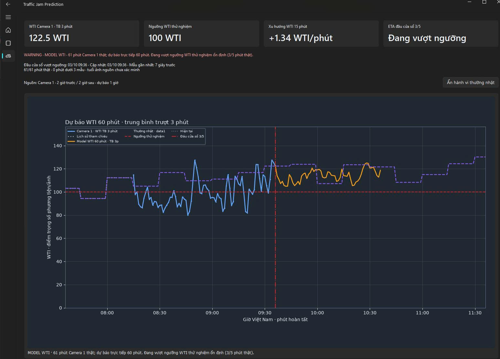
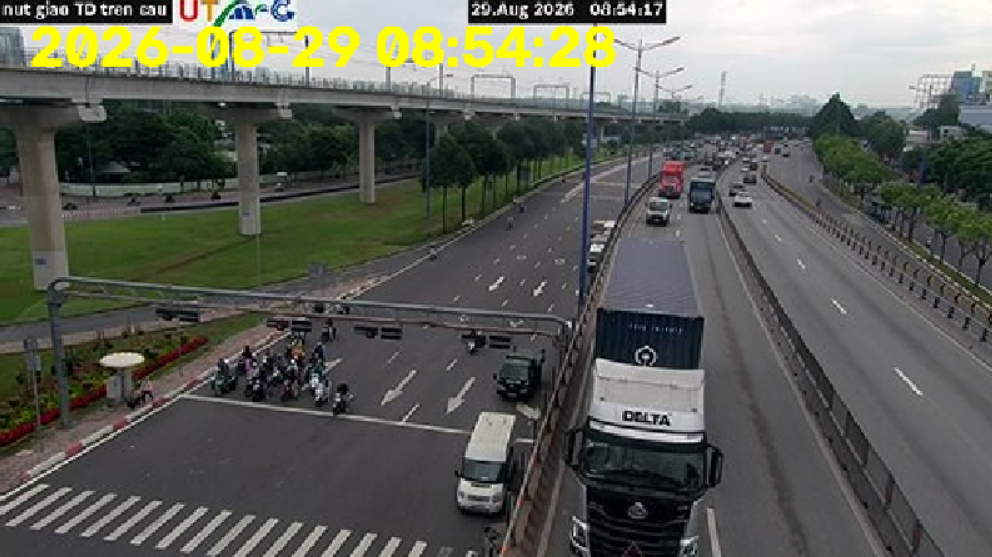
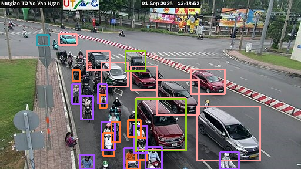
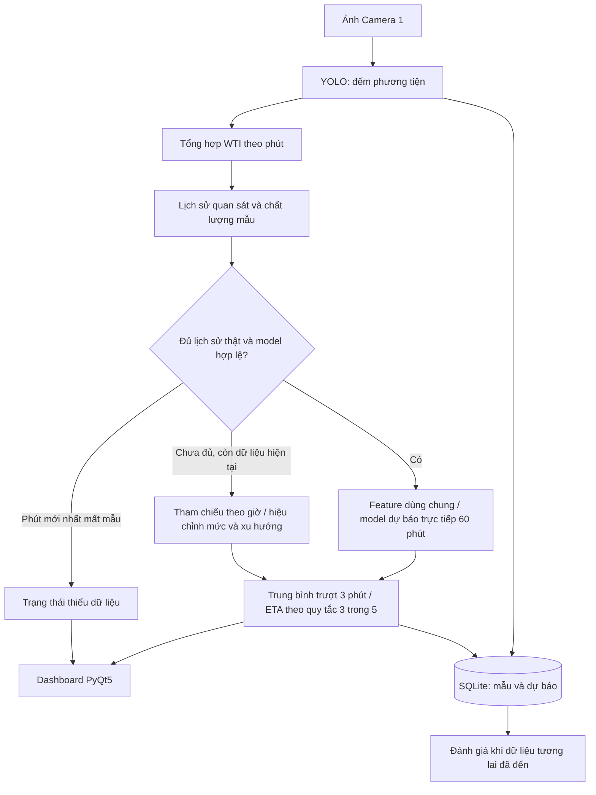
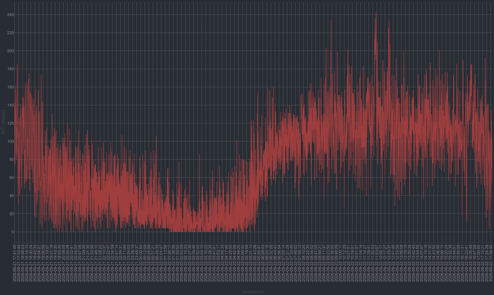
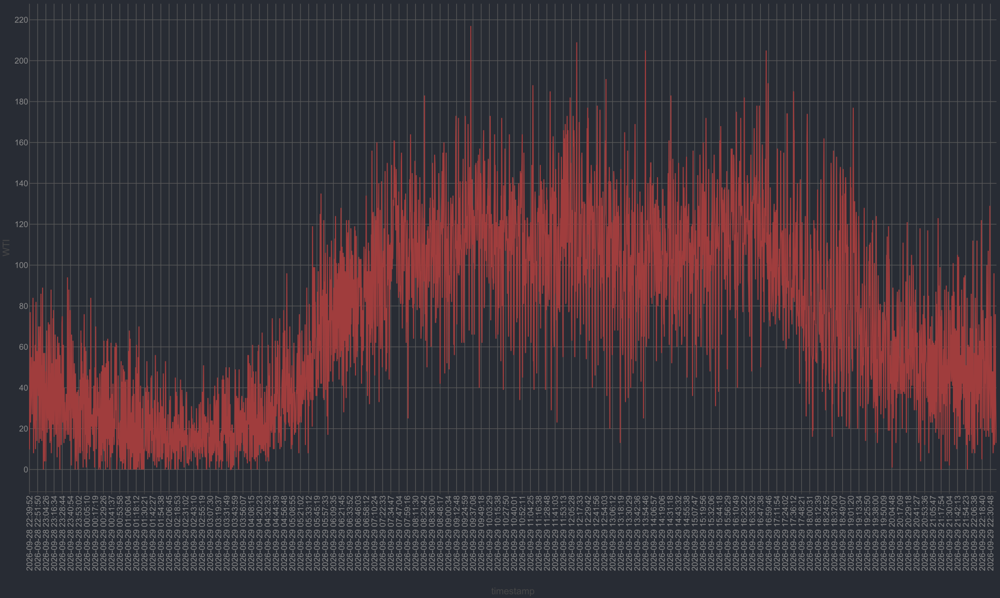
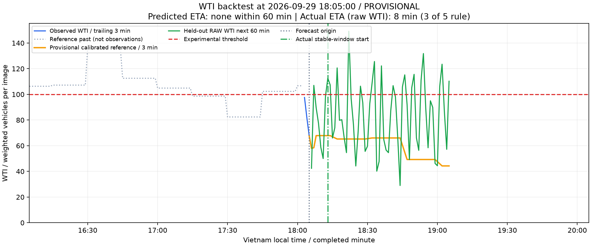

<div align="center">

# Traffic Congestion Prediction

**Từ ảnh camera đến đường dự báo giao thông**

Python · YOLO · scikit-learn · PyQt5 · SQLite

[Bắt đầu](#cài-đặt-và-chạy) · [Hình ảnh](#nhận-diện-phương-tiện) · [Dữ liệu](#dữ-liệu-và-quy-ước-thời-gian) · [Đánh giá](#đánh-giá-và-kiểm-thử)

</div>



*Dashboard trong ảnh chụp lưu tại `runs/run.jpg`: lịch sử WTI, đường dự báo 60 phút,
tham chiếu theo giờ và trạng thái vượt ngưỡng. Các giá trị là tại thời điểm chụp ảnh.*

**Ứng dụng desktop theo dõi giao thông Camera 1, dự báo đường cong WTI trong 60 phút và ước lượng thời gian vượt ngưỡng đông xe thử nghiệm.**

Dự án kết hợp nhận diện phương tiện bằng YOLO, xử lý chuỗi thời gian bằng pandas,
model scikit-learn và giao diện PyQt5. Mục tiêu nghiên cứu là tiến tới cảnh báo sớm
ùn tắc tại nút giao thông từ dữ liệu quan sát liên tục.

> **Trạng thái: prototype nghiên cứu.** Phiên bản hiện tại dự báo điểm trọng số
> phương tiện trên ảnh (WTI). Ngưỡng 100 WTI chưa được hiệu chuẩn bằng nhãn kẹt xe
> thực tế; kết quả không phải cam kết đường thông thoáng hay dự báo kẹt xe chính xác.

| Thành phần | Hiện trạng |
|---|---|
| Ứng dụng | Desktop PyQt5: Home, Camera, Dashboard |
| Nguồn dự báo | Camera 1, cố định khi người xem đổi camera |
| Đại lượng dự báo | WTI trung bình mỗi phút, không dùng WTI_norm |
| Horizon | 60 điểm tương ứng 60 phút tiếp theo |
| Model | MultiOutputRegressor + HistGradientBoostingRegressor |
| Lưu trữ vận hành | SQLite: mẫu quan sát và dự báo đã phát ra |
| Phạm vi đánh giá | Hai capture gần 24 giờ; test theo thời gian |

## Nội dung

- [Mục tiêu và phạm vi](#mục-tiêu-và-phạm-vi)
- [Nhận diện phương tiện](#nhận-diện-phương-tiện)
- [Kiến trúc hệ thống](#kiến-trúc-hệ-thống)
- [Cài đặt và chạy](#cài-đặt-và-chạy)
- [Sử dụng Dashboard](#sử-dụng-dashboard)
- [Dữ liệu và quy ước thời gian](#dữ-liệu-và-quy-ước-thời-gian)
- [Huấn luyện và quản lý model](#huấn-luyện-và-quản-lý-model)
- [Đánh giá và kiểm thử](#đánh-giá-và-kiểm-thử)
- [Cấu trúc repository](#cấu-trúc-repository)
- [Cấu hình và xử lý sự cố](#cấu-hình-và-xử-lý-sự-cố)
- [Giới hạn và lộ trình](#giới-hạn-và-lộ-trình)
- [Đóng góp, tác giả và giấy phép](#đóng-góp-tác-giả-và-giấy-phép)

## Mục tiêu và phạm vi

Dự án tập trung vào ba câu hỏi:

1. Mức hiện diện của phương tiện trong vùng camera đang tăng hay giảm?
2. Đường WTI có thể diễn biến thế nào trong 5, 15, 30 và 60 phút tiếp theo?
3. Khi nào dự báo xuất hiện một cửa sổ vượt ngưỡng đủ ổn định để cảnh báo?

Case study của dự án là khu vực **Ngã Tư Thủ Đức, TP. Hồ Chí Minh**. Ảnh được lấy
qua nguồn camera giao thông công cộng; ánh xạ Camera 1 nằm trong
[core/Get_frame.py](core/Get_frame.py). Camera có thể thay đổi góc nhìn hoặc nguồn
ảnh, vì vậy dữ liệu và model cần được kiểm tra lại khi nguồn thay đổi.

WTI được tính bằng:

```text
WTI = 4 × car + 1 × motorbike + 7 × bus + 6 × truck
```

WTI là điểm đếm có trọng số trên mỗi ảnh, chưa phải mật độ xe/km, lưu lượng
xe/phút hay tốc độ giao thông. `person` không nằm trong công thức. CSV có thể chứa
`WTI_norm`, nhưng feature và target của model hiện tại không sử dụng cột này.

**Hướng phát triển:** bổ sung ROI, chất lượng ảnh, tốc độ/hàng chờ được kiểm chứng
và nhãn ùn tắc độc lập để chuyển từ cảnh báo vượt ngưỡng WTI sang dự báo trạng thái
giao thông có thể đánh giá ngoài thực tế.

## Nhận diện phương tiện

Ảnh đầu vào và kết quả nhận diện được đặt cạnh nhau để minh họa bước chuyển từ
snapshot camera sang đối tượng được phát hiện. Bấm vào ảnh để xem bản đầy đủ.

<table>
  <tr>
    <th width="50%">Ảnh thử nghiệm đầu vào</th>
    <th width="50%">Kết quả YOLO đã lưu</th>
  </tr>
  <tr>
    <td><a href="test_img/1.png"></a></td>
    <td><a href="runs/detect/predict/1.jpg"></a></td>
  </tr>
</table>

*Nguồn: [`test_img/1.png`](test_img/1.png) và
[`runs/detect/predict/1.jpg`](runs/detect/predict/1.jpg). Đây là kết quả thử nghiệm
đã lưu; ảnh có thể chứa đối tượng ngoài bốn nhóm xe được dùng để tính WTI.*

<details>
<summary><strong>Xem thêm: nhận diện bằng Supervision và chia lát ảnh</strong></summary>

<p align="center">
  <a href="runs/supervision_test9.png"></a>
</p>

[`test_yolo.py`](test_yolo.py) sử dụng `supervision.InferenceSlicer` với lát ảnh
512 × 512 và lưu kết quả vào `runs/supervision_test9.png`. Đây là script thử
nghiệm riêng. Các khung trong ảnh minh họa đầu ra detector, chưa phải bằng chứng
đánh giá precision/recall trên dữ liệu có nhãn.

</details>

## Kiến trúc hệ thống



- `CameraWorker` lấy ảnh và chạy YOLO ngoài UI thread. Camera đang xem không đổi
  danh tính nguồn dự báo; việc xử lý camera xem thêm vẫn có thể ảnh hưởng chu kỳ
  lấy mẫu do dùng chung vòng worker.
- `ForecastWorker` giữ lịch sử, tổng hợp phút, load model một lần, chạy inference
  và ghi SQLite trên worker riêng.
- Feature engineering có một nguồn dùng chung trong `core/traffic_features.py`.
- Widget Matplotlib tái sử dụng Figure và artist khi cập nhật.
- App không tự huấn luyện model. Huấn luyện là lệnh chủ động, độc lập với UI.

### Hai chế độ dự báo

| Chế độ | Điều kiện và cách tính |
|---|---|
| Model WTI | Có bundle hợp lệ và 61 phút thật liên tục, mỗi phút ít nhất 3 mẫu; model trả trực tiếp t+1…t+60 |
| Tạm thời | Dùng đường tham chiếu từ data1, điều chỉnh mức gần đây và xu hướng từ tối đa 30 phút thật liên tục; hiệu chỉnh giảm dần ở horizon xa |
| Thiếu dữ liệu | Phút mới nhất không có mẫu: dừng dự báo, hiển thị khoảng thiếu |

61 điểm phút cần thiết để có cả giá trị hiện tại và lag 60. Lịch sử tham chiếu
chỉ phục vụ khởi động/hiển thị; không được đưa vào model như quan sát thật.
Đường tham chiếu hiện là trung bình theo ô 15 phút của data1, chưa phải quy luật
thường nhật được thống kê từ nhiều tuần.

## Cài đặt và chạy

### Yêu cầu

- Windows và Python 3.11 là môi trường đã được sử dụng trong project.
- Có kết nối Internet để lấy ảnh camera; train và backtest trên CSV có thể chạy offline.
- Có trọng số detector `yolo26x.pt` tại thư mục gốc. Các file `.pt` được bỏ qua bởi
  Git, nên checkout mới cần chuẩn bị trọng số tương ứng từ nguồn Ultralytics tin cậy.
- Có hai CSV trong `data/` để train và tạo tham chiếu khi cần.
- Chưa công bố cấu hình phần cứng tối thiểu hay FPS được bảo đảm; cần đo hiệu năng
  YOLO trên máy triển khai.

Chạy mọi lệnh dưới đây từ thư mục gốc repository.

### Dùng môi trường đang có

```powershell
conda activate traffic-congestion-prediction
python main.py
```

### Tạo môi trường mới

```powershell
conda create -n traffic-congestion-prediction python=3.11 -y
conda activate traffic-congestion-prediction
python -m pip install -r requirements.txt
python main.py
```

[requirements.txt](requirements.txt) chứa các phiên bản dependency hiện tại.
[environment.yml](environment.yml) là bản môi trường Windows có các build cụ thể
và `prefix` theo máy gốc; cần điều chỉnh khi tái tạo trên máy khác. Cài mới trên
mọi hệ điều hành chưa được xác minh.

Giao diện dùng **PyQt5**. Dependency snapshot còn liệt kê PyQt6, nhưng code UI không
sử dụng binding này; không trộn widget của hai binding trong cùng ứng dụng.

Model đang có trong workspace được lưu với sklearn **1.9.1**. Các dependency liên
quan đang ghim pandas **3.0.6**, joblib **1.6.0**, numpy **2.4.6**, scipy **1.17.1**.
Dùng cùng môi trường cho train và inference. `.venv` cũ sklearn 1.7.2 không tương
thích với bundle này.

Kiểm tra interpreter khi gặp lỗi môi trường:

```powershell
python -c "import sys, sklearn, pandas, joblib; print(sys.executable); print(sklearn.__version__, pandas.__version__, joblib.__version__)"
```

## Sử dụng Dashboard

1. Mở app bằng `python main.py`.
2. Tab **Camera** cho phép chọn camera và bật/tắt khung nhận diện. Detect trên màn
   hình mặc định tắt; Camera 1 vẫn cung cấp số đếm cho dự báo nền.
3. Tab **Dashboard** hiển thị hai giờ trước và hai giờ sau, hiện tại nằm giữa;
   đường dự báo kéo dài một giờ.
4. Bật **Hiện hành vi thường nhật** để đối chiếu với tham chiếu theo giờ của data1.
5. Đọc trạng thái nguồn dự báo, số phút thật, chất lượng mẫu và ETA cùng với đồ thị.

| Thành phần đồ thị | Ý nghĩa |
|---|---|
| Đường xanh | WTI Camera 1 thực tế, trung bình trượt 3 phút |
| Lịch sử tham chiếu | Phần trước khởi động chưa có quan sát; được đánh dấu riêng |
| Đường cam | Dự báo model hoặc tạm thời; trạng thái chỉ rõ nguồn |
| Đường tham chiếu bật/tắt | Mức theo giờ từ data1 |
| Đường ngang đỏ | Ngưỡng WTI thử nghiệm |
| Mốc dọc | Hiện tại và thời điểm đầu cửa sổ vượt ngưỡng dự kiến |

### Ngưỡng và ETA

Ngưỡng hiện tại là **100 WTI**. Cảnh báo xét cửa sổ đầy đủ gồm năm phút dự báo,
trong đó ít nhất ba phút **lớn hơn** ngưỡng; bằng 100 chưa được coi là vượt.
ETA được tính đến **đầu cửa sổ đầu tiên** thỏa điều kiện, nên phút bắt đầu cửa sổ
không nhất thiết đã vượt ngưỡng. ETA dự báo dùng đường đã làm mượt ba phút.

Nếu năm phút thật gần nhất đã có ít nhất ba phút vượt ngưỡng, UI hiển thị đang
vượt ngưỡng và ETA bằng 0. “Chưa thấy vượt” chỉ nói về đường dự báo hiện tại,
không bảo đảm giao thông thông thoáng.

| Trạng thái | Diễn giải |
|---|---|
| `NORMAL` | Model chưa dự báo thấy cửa sổ vượt ngưỡng trong 60 phút |
| `PROVISIONAL` | Ước lượng tạm thời, độ tin cậy thấp; chưa dự báo thấy vượt ngưỡng |
| `WATCH` | Dự báo cửa sổ vượt ngưỡng bắt đầu sau hơn 5 phút |
| `WARNING` | Dự báo vượt trong tối đa 5 phút hoặc quan sát đang vượt ổn định |
| `INSUFFICIENT_DATA` | Chưa có dữ liệu hiện tại/lịch sử cần thiết |
| `MODEL_ERROR` | Không thể tạo kết quả do lỗi model hoặc xử lý dữ liệu |

Nhánh tạm thời cũng có thể hiện WATCH/WARNING, kèm thông báo TẠM THỜI. Nếu load
model lỗi nhưng còn tham chiếu, app vẫn có thể vẽ dự báo tạm thời và nêu lỗi cụ thể.

## Dữ liệu và quy ước thời gian

### Dataset hiện có

| Tập | Khoảng phút hoàn tất, giờ Việt Nam | Số ảnh | Phút tổng hợp | Origin train/test hợp lệ |
|---|---|---:|---:|---:|
| data1 | 21/09/2026 17:43 → 22/09/2026 17:41 | 7.044 | 1.439 | 1.098 |
| data2 | 28/09/2026 22:41 → 29/09/2026 22:39 | 7.065 | 1.439 | 956 |

Các số origin trên thuộc báo cáo training hiện có, sau khi loại cửa sổ thiếu
history/target. Khoảng cách mẫu trung vị khoảng 12 giây. data1 có hai phút mất
mẫu, data2 có ba phút; không nên diễn giải số cửa sổ chồng lấn thành số tình huống
độc lập. Xem [phân tích data1](data/data1_analysis.MD) và
[phân tích data2](data/data2_analysis.MD).

Schema CSV collector:

```text
timestamp, person, car, motorbike, bus, truck, total, WTI, WTI_norm
```

Sau tổng hợp phút, hệ thống giữ trung bình từng loại xe, `total_mean`, `WTI_mean`,
độ lệch chuẩn và cực đại của total/WTI, cùng `samples_per_minute`.

- Khoảng `[10:00, 10:01)` được gắn nhãn **10:01**, khi phút hoàn tất.
- Timestamp hiện tại là giờ máy nhận ảnh, trước YOLO, theo giờ Việt Nam; chưa xác
  minh được thời điểm camera nguồn chụp ảnh. Máy chạy cần đặt đúng múi giờ.
- Phút thiếu giữ NaN. Hai biên CSV chưa đầy đủ bị loại khi tạo tập train/test.
- Các CSV cũ thiếu metadata camera/ROI/detector; cần bổ sung trong đợt thu mới.

### Biểu đồ dữ liệu quan sát

Hai biểu đồ dưới đây trình bày diễn biến WTI của các đợt thu dữ liệu. Đây là dữ
liệu quan sát, không phải đường dự báo. Bấm vào từng ảnh để đọc trục thời gian
ở kích thước gốc.

**Đợt 1 · 21–22/09/2026**

[](data/chart1.png)

*WTI biến động theo thời điểm trong ngày, với mức thấp vào ban đêm và tăng trở lại
vào buổi sáng. [Đọc phân tích data1](data/data1_analysis.MD).*

<details>
<summary><strong>Đợt 2 · 28–29/09/2026 — xem biểu đồ đối chiếu</strong></summary>

[](data/chart2.png)

*Đợt thu thứ hai được dùng để đánh giá model đã học từ data1.
[Đọc phân tích data2](data/data2_analysis.MD). Hai đợt thu chưa đủ để kết luận
về quy luật giao thông dài hạn.*

</details>

### Thu CSV độc lập

```powershell
python get_data.py --camera "Camera 1" --output runs/camera1_new_capture.csv --max-seconds 86400
```

Collector mở cửa sổ OpenCV; nhấn `q` để dừng. Dữ liệu được ghi mỗi năm mẫu và ghi
phần còn lại khi thoát qua `finally`. Tên output đã tồn tại bị từ chối để tránh
mất dữ liệu cũ. Tiến trình bị kết thúc cưỡng bức vẫn có thể mất batch chưa ghi.

### Lịch sử vận hành

App tự tạo `runs/traffic_history.sqlite3` chứa mẫu Camera 1 và các dự báo đã phát
ra. Khi khởi động lại, worker khôi phục phần lịch sử gần nhất; thời gian app tắt
vẫn được xem là thiếu dữ liệu. SQLite không tự được dùng để train lại model.

File database được bỏ qua bởi Git. Sao lưu khi app đã đóng và theo dõi dung lượng:
hiện chưa có cơ chế tự xóa dữ liệu cũ. Xóa database sẽ mất lịch sử và khả năng chấm
điểm các dự báo trước đó.

## Huấn luyện và quản lý model

### Xem cấu trúc và train

```powershell
# Chỉ in cấu trúc và feature, không fit
python training_model.Py --describe

# Train trên data1, đánh giá trên data2
python training_model.Py
```

Có thể chỉ định dữ liệu và nơi lưu:

```powershell
python training_model.Py --train data/data1.csv --test data/data2.csv --output models/traffic_wti_forecast.joblib
```

Tên entry point hiện tại là **`training_model.Py`**. Code có thể đọc và sửa trực
tiếp tại `build_model()`. `scripts/train_traffic_forecast.py` chỉ là entry point
chuyển tiếp để tương thích.

### Thiết kế model

- `MultiOutputRegressor(HistGradientBoostingRegressor)` gồm 60 bộ hồi quy trực tiếp,
  mỗi bộ dự báo một horizon; không dự báo recursive.
- Cấu hình mặc định: 200 vòng boosting, 15 leaf tối đa, learning rate 0,05,
  min samples leaf 25, L2 regularization 5, tắt early stopping ngẫu nhiên.
- 61 feature: thống kê phút hiện tại; lag 1/2/3/5/10/15/30/60 cho total và WTI;
  rolling mean/std/min/max, slope, hour sin/cos. Chỉ dùng quan sát hiện tại/quá khứ.
- So sánh target WTI tuyệt đối và delta so với hiện tại bằng validation cuối
  data1. Loại origin train có cửa sổ target chạm validation, không random shuffle.
- Chọn mode theo MAE validation, refit toàn data1 và đánh giá trên data2.
- Baseline gồm persistence, ngoại suy tuyến tính slope 15 phút và cùng giờ data1.

### Artifact và kích hoạt

| Artifact | Vai trò |
|---|---|
| `models/traffic_wti_forecast.joblib` | Bundle mặc định được app load |
| `models/traffic_wti_forecast.metrics.json` | Báo cáo dữ liệu, split, baseline, MAE và vượt ngưỡng |
| `models/*.candidate-*.joblib` | Model mới khi tên output đã tồn tại; chưa được kích hoạt |

Bundle chứa estimator, thứ tự feature, target mode, horizon, history, interval,
ngưỡng, smoothing, profile tham chiếu và metric. Các lần train bằng script mới còn
lưu phiên bản Python/sklearn/pandas/numpy/joblib để hỗ trợ tái lập môi trường.

Để đánh giá candidate, truyền đường dẫn đó vào backtest bằng `--model`. Chỉ sau
khi xem metric và backtest, đóng app, sao lưu bundle/metric đang dùng rồi đặt
candidate được chọn cùng metric vào tên mặc định. Mở lại app để load model mới.
Script không tự thay model đang dùng hoặc tự bảo đảm candidate tốt hơn baseline.

## Đánh giá và kiểm thử

### Kết quả model hiện có

Báo cáo [traffic_wti_forecast.metrics.json](models/traffic_wti_forecast.metrics.json)
đánh giá trên **956 origin của data2**. MAE tính bằng WTI, dự báo làm mượt ba phút
được so với WTI trung bình phút gốc.

| Phương pháp | MAE trung bình 60 horizon ↓ | MAE t+60 ↓ | F1 vượt ngưỡng ↑ |
|---|---:|---:|---:|
| Model HGB | 14,12 | 14,71 | 0,955 |
| Tham chiếu cùng giờ data1 | 14,71 | 14,35 | 0,971 |
| Persistence | 18,55 | 20,70 | 0,683 |

Model tốt hơn persistence nhưng chưa hơn tham chiếu cùng giờ ở mọi mục tiêu.
F1 trên đây xét cửa sổ WTI vượt 100, có chồng lấn, không phải độ chính xác dự báo
kẹt xe thực tế. Sai số ETA chỉ tính trên các origin cả dự báo và thực tế cùng có
vượt ngưỡng nên phải đọc kèm số bỏ sót và báo giả.

Replay nhánh tạm thời mới trên cùng 32 origin data2 với ba phút realtime cho MAE
**14,39**, so với **16,83** của phép nhân tỷ lệ trước đây. Đây là kết quả replay
riêng, không phải metric mới của model HGB hay bằng chứng tổng quát trên nhiều ngày.
Báo cáo bundle đã lưu phản ánh thuật toán tại lúc train; không tự cập nhật theo
những thay đổi runtime sau đó. Phân tích chi tiết tại
[traffic_forecast_audit.md](reports/traffic_forecast_audit.md).

### Backtest trực quan

[](reports/wti_warmup_backtest.png)

*Ví dụ backtest đã lưu: đường cam là dự báo tạm thời, đường xanh lá là WTI thực
tế trong 60 phút tiếp theo, đường đỏ là ngưỡng thử nghiệm. Tại origin này, dự báo
không phát hiện cửa sổ vượt ngưỡng trong khi thực tế có ETA 8 phút — một ví dụ
bỏ sót cần được đọc cùng metric tổng hợp. Xem
[JSON đi kèm](reports/wti_warmup_backtest.json); ảnh phản ánh lần chạy đã lưu,
không tự cập nhật khi thuật toán thay đổi.*

```powershell
# Chọn một origin trong data2, dùng model hiện tại
python scripts/backtest_traffic_forecast.py --at "2026-09-29 18:05"

# Replay khởi động với ba phút thật
python scripts/backtest_traffic_forecast.py --at "2026-09-29 18:05" --warmup-minutes 3 --output reports/wti_warmup_backtest.png
```

Script xuất PNG và JSON gồm quá khứ, 60 phút dự báo, 60 phút thực tế tiếp theo,
ngưỡng và ETA. Origin phải có đủ history/target; `--warmup-minutes` nhận 0–60.

### Chấm điểm dự báo đã phát ra

```powershell
python scripts/evaluate_live_forecasts.py
```

Lệnh đọc SQLite, lấy dự báo đầu tiên tại mỗi origin, chờ đủ 60 phút ground truth
và loại cửa sổ có phút dưới ba mẫu. Kết quả được tách theo phương pháp/model/ngưỡng.
Không có đủ dữ liệu sẽ chưa có metric; lệnh không tạo hoặc sửa model.

### Kiểm thử phần mềm

```powershell
python -m unittest discover -s tests -v
python -m compileall -q core ui scripts tests training_model.Py get_data.py
```

Lần xác minh gần nhất của đợt cải tiến 02/10/2026: **39 tests đạt**. Phạm vi gồm
resample, feature không dùng tương lai, schema train/inference, horizon, ETA,
nhánh tạm thời, mẫu đến muộn, thiếu mẫu, lưu/khôi phục SQLite, collector và replay
UI qua worker. Các test sử dụng model giả, không train.

Đã kiểm tra load/inference model trong Conda và replay UI ở chế độ không màn
hình. Các kết quả này không chứng minh độ chính xác realtime hoặc hiệu năng
camera thực tế dài hạn. Việc cài môi trường mới từ đầu chưa nằm trong xác minh đó.

## Cấu trúc repository

```text
Traffic_congestion_prediction/
├── main.py                         # Khởi tạo ứng dụng và worker camera
├── training_model.Py               # Entry point train, cấu trúc model và metric
├── get_data.py                     # Collector Camera → YOLO → CSV
├── requirements.txt
├── environment.yml
├── LICENSE
├── core/
│   ├── Get_frame.py                # Snapshot và ánh xạ camera
│   ├── Yolo_detect.py              # Detector, counts và công thức WTI
│   ├── vision_worker.py            # Worker camera/YOLO
│   ├── traffic_features.py         # Cấu hình, resample, feature và target
│   ├── traffic_forecast.py         # Load model, dự báo và ETA
│   ├── forecast_worker.py          # Lịch sử phút, lịch cập nhật và persistence
│   └── traffic_store.py            # SQLite samples/forecasts
├── ui/
│   ├── main_window.py
│   ├── traffic_forecast_chart.py   # Matplotlib widget tái sử dụng
│   └── tabs/                      # Home, Camera, Dashboard
├── utils/app_state.py              # Trạng thái camera đang xem
├── scripts/
│   ├── train_traffic_forecast.py   # Entry point tương thích
│   ├── backtest_traffic_forecast.py
│   ├── evaluate_live_forecasts.py
│   └── check_traffic_ui.py         # Công cụ kiểm tra UI/replay bổ trợ
├── tests/                         # Kiểm thử offline và UI worker
├── test_img/                      # Ảnh đầu vào thử nghiệm nhận diện
├── test_yolo.py                   # Thử nghiệm YOLO với Supervision slicer
├── data/                          # CSV nguồn, biểu đồ và phân tích dữ liệu
├── models/                        # Bundle và metric training
├── reports/                       # Audit, hình/JSON backtest
├── runs/                          # CSV thu thêm, SQLite, ảnh kết quả
└── yolo26x.pt                      # Trọng số detector, không được Git theo dõi
```

`models/` chứa kết quả học; `reports/` chứa bằng chứng đánh giá; `runs/` chứa dữ
liệu vận hành. Không cần xóa model khi chỉ cập nhật UI. Xóa bundle sẽ khiến app
chuyển sang nhánh tạm thời nếu còn tham chiếu; báo cáo cũ không phải model đang chạy.

## Cấu hình và xử lý sự cố

Các cấu hình chính nằm trong [core/traffic_features.py](core/traffic_features.py).

| Cấu hình | Mặc định | Ý nghĩa |
|---|---|---|
| `FORECAST_CAMERA` | Camera 1 | Nguồn số đếm cho dự báo |
| `TARGET_COLUMN` | WTI_mean | Đại lượng dự báo theo phút |
| `FORECAST_HORIZON` | 60 | Số phút dự báo |
| `HISTORY_POINTS` | 61 | Số điểm lịch sử model cần |
| `DISPLAY_WINDOW` | 120 | Số phút mỗi phía của trục thời gian |
| `SMOOTHING_WINDOW` | 3 | Làm mượt quan sát và dự báo |
| `MIN_SAMPLES_PER_MINUTE` | 3 | Độ phủ tối thiểu cho model và chấm điểm live |
| `CONGESTION_THRESHOLD` | 100 | Ngưỡng WTI thử nghiệm |

Thay target, horizon, schema, ngưỡng hoặc smoothing cần xem lại tính tương thích
bundle: loader kiểm tra metadata và có thể từ chối model cũ. Thay camera cũng cần
thu dữ liệu và đánh giá lại tính phù hợp của model/ngưỡng.

| Hiện tượng | Cách kiểm tra |
|---|---|
| `No module named sklearn` | Kiểm tra `sys.executable`, kích hoạt đúng môi trường và cài dependency trong môi trường đó |
| Khác phiên bản sklearn hoặc lỗi load bundle | Dùng môi trường đã train, kiểm tra file model; không train lại chỉ vì mở nhầm Python |
| TẠM THỜI kéo dài | Xem số phút thật, số mẫu/phút, khoảng mất dữ liệu và thông báo lỗi model |
| Không có đường dự báo | Xem mẫu phút mới nhất, nguồn camera, kết nối mạng và trạng thái thiếu dữ liệu |
| Khung camera chưa có bounding box | Bật nút detect của tab Camera; đây là điều khiển hiển thị |
| Không ghi được lịch sử | Kiểm tra quyền ghi và dung lượng thư mục `runs/`; lỗi được đưa lên Dashboard |
| Train sinh thêm candidate | Đây là cơ chế giữ model cũ; đánh giá candidate trước khi kích hoạt |

## Giới hạn và lộ trình

### Giới hạn hiện tại

- Hai capture không đại diện cho tuần, mùa, mưa, sự cố hoặc các điều kiện giao thông khác.
- Detector chưa được chấm trên tập ảnh có nhãn cùng camera; chưa có ROI theo làn,
  tốc độ, queue length hoặc đánh giá ảnh tối/mờ.
- Snapshot thưa và chưa biết tuổi ảnh nguồn; nhịp xử lý thay đổi theo tải máy.
- Ngưỡng WTI chưa có nhãn độc lập; làm mượt có thể giảm đỉnh và thay đổi ETA.
- Chưa có khoảng dự báo được hiệu chuẩn hoặc xác suất sự kiện đáng tin cậy.
- Lịch sử thiếu mẫu và chuyển từ tạm thời sang model có thể làm đường dự báo đổi.
- Chưa có cơ chế tự chấp nhận model mới, retention database, đóng gói installer
  hoặc bằng chứng vận hành liên tục đạt SLA.

### Các mốc phát triển

| Ưu tiên | Công việc | Bằng chứng cần đạt |
|---|---|---|
| 1. Dữ liệu đáng tin cậy | Thu nhiều tuần, lưu metadata camera/ROI/detector, kiểm tra tuổi ảnh và lỗi nhận diện | Báo cáo coverage, latency và sai số đếm theo điều kiện |
| 2. Nhãn giao thông | Chấm trạng thái ùn tắc, tốc độ/hàng chờ hoặc thời gian chờ theo quy tắc thống nhất | Dataset có nhãn độc lập với WTI, ngưỡng được chọn trên train/validation |
| 3. Model và bất định | So sánh HGB, baseline thích nghi và dự báo phần dư; đánh giá nhiều ngày | Vượt baseline theo mục tiêu đã thống nhất, có coverage theo horizon |
| 4. Cảnh báo sự kiện | Đánh giá onset 5/15/30/60 phút, hiệu chuẩn xác suất, hysteresis | Báo giả/giờ, bỏ sót episode, lead time và ETA trên ngày mới |
| 5. Vận hành | Chạy quan sát dài hạn, kiểm thử restart/mất mạng, retention và quản lý phiên bản | Dự báo được ghi trước khi ground truth đến, có quy trình rollback |

Data2 đã được sử dụng để phân tích và điều chỉnh thiết kế; các vòng phát triển sau
cần tập ngày mới giữ riêng cho đánh giá cuối. Không chọn phương pháp chỉ vì đường
vẽ mượt hoặc một metric tốt trên các cửa sổ chồng lấn.

## Đóng góp, tác giả và giấy phép

### Đóng góp

Mỗi thay đổi nên nêu rõ vấn đề, phạm vi, cách kiểm chứng và giới hạn. Giữ chung
logic feature train/inference, chia dữ liệu theo thời gian, tránh xử lý nặng trong
UI thread. Không commit database vận hành, trọng số hoặc thông tin máy cá nhân
ngoài phạm vi cần thiết. Khi thay thuật toán, kèm baseline và dữ liệu đánh giá;
không tuyên bố chất lượng dự báo từ unit test.

### Nhóm thực hiện

Môn học: **Python for Data Science — Cơ sở khoa học dữ liệu**

Giảng viên: **Nguyễn Mạnh Hùng**

| MSSV | Họ tên |
|---|---|
| 25139048 | Nguyễn Tuấn Thịnh |

### Giấy phép và nguồn dữ liệu

Mã nguồn được phát hành theo **The Unlicense**, xem [LICENSE](LICENSE).
Nguồn ảnh được sử dụng trong project: [Cổng thông tin giao thông TP. Hồ Chí Minh](https://giaothong.hochiminhcity.gov.vn).
Giấy phép mã nguồn không tự cấp quyền cho ảnh camera, dataset hoặc trọng số bên
thứ ba; cần kiểm tra điều kiện của từng nguồn trước khi phân phối hoặc triển khai.
