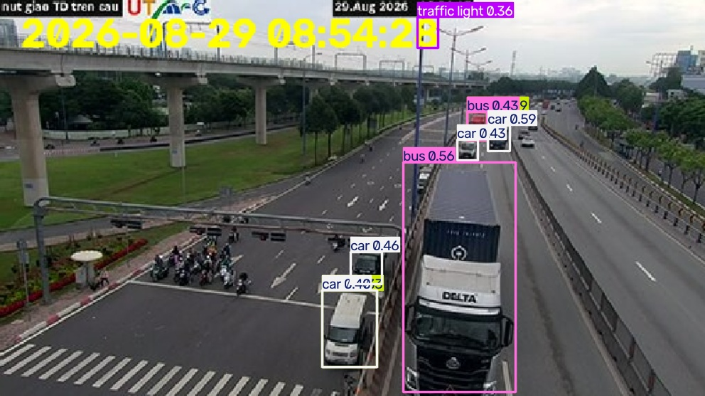

# 🚦 Traffic Jam Time-to-Congestion Prediction

**Predicting time-until-congestion at a traffic intersection using real-time public camera feeds, YOLO object detection, and time-series regression.**

Course: **Python for Data Science** (Cơ sở khoa học dữ liệu)
Instructor: **Nguyễn Mạnh Hùng**

| Student ID | Name |
|---|---|
| 25139048 | Nguyễn Tuấn Thịnh |
| 24139005 | Nguyễn Đình Tú Bảo |

---

## 📍 Case Study Location

**Ngã Tư Thủ Đức (Thủ Đức Intersection)**, Ho Chi Minh City — one of the most congestion-prone intersections in the city.

Live camera feed source: [giaothong.hochiminhcity.gov.vn](https://giaothong.hochiminhcity.gov.vn)

<p align="center">
  
</p>

*Sample output: real-time camera frame with vehicle detection (car, bus, truck, traffic light) overlaid by the YOLO model.*

---

## 🎯 Problem Statement

Instead of just detecting how many vehicles are on the road **right now**, this project asks a more useful question:

> **Given the current and historical traffic pattern, how many minutes until this intersection becomes congested?**

Since the camera is static and cannot measure vehicle speed directly, **congestion is defined indirectly** through vehicle density: a given moment is considered "congested" when the total number of detected vehicles exceeds the **85th–90th percentile** of the historical distribution for that same time-of-day. This threshold will be calibrated after enough real data has been collected (see EDA phase).

### Research Questions
1. How does vehicle volume (motorbike, car, truck, container, bus) vary by hour of day and day of week?
2. What does a "normal" traffic baseline look like for each time slot, and how far is the current moment deviating from it?
3. Based on current data, how many minutes remain before vehicle density crosses the congestion threshold?

---

## 🧱 Pipeline Overview

The project follows a standard data lifecycle, structured into 9 stages:

| # | Stage | Description |
|---|---|---|
| 1 | **Data Collection** | Pull live snapshots from the public HCMC traffic camera API, run YOLO inference immediately, and log vehicle counts (not raw images) with a timestamp. |
| 2 | **Data Cleaning** | Drop failed/corrupted frames, filter out low-light or blurry (rainy) frames, remove duplicate/static frames, flag missing data instead of imputing. |
| 3 | **Exploratory Data Analysis (EDA)** | Hourly/weekday traffic charts, hour × weekday heatmaps, vehicle-type composition, stationarity & seasonality checks. |
| 4 | **Feature Engineering** | Cyclical time encoding (sin/cos hour), vehicle counts by class, rolling means (5/15/30 min), deviation from baseline, lag features. |
| 5 | **Modeling — Detection** | YOLO for real-time vehicle counting. |
| 6 | **Modeling — Baseline Behavior** | Typical traffic pattern per time slot, visualized as bar (actual) + dashed line (expected baseline). |
| 7 | **Modeling — Time-to-Congestion** | Regression model predicting minutes remaining until the congestion threshold is crossed. |
| 8 | **Evaluation** | Precision/Recall for detection; MAE/RMSE (time-based split) for the regression model, benchmarked against simple baselines. |
| 9 | **Deployment** | Scheduled GitHub Actions pipeline + a static dashboard (GitHub Pages / Streamlit) showing live predictions. |

---

## 🤖 Model Architecture

```
Live Camera Frame
      │
      ▼
YOLO (Ultralytics) ──────────► Vehicle counts by class (car, motorbike, bus, truck)
      │
      ▼
Prophet / STL ───────────────► Typical traffic baseline per time slot (for visualization)
      │
      ▼
XGBoost / LightGBM Regressor ─► Predicted minutes remaining until congestion
```

- **Detection:** YOLO (Ultralytics), pretrained on COCO — classes used: `car (2)`, `motorcycle (3)`, `bus (5)`, `truck (7)`. Fine-tuning on a small hand-labeled set from this intersection is planned if time allows, since COCO has no dedicated classes for container trucks / official vehicles (currently merged into `truck`).
- **Baseline modeling:** Prophet/STL to capture typical hourly/weekday seasonality, visualized as actual (bar) vs. expected (dashed line).
- **Time-to-congestion regression:**
  - **Main model:** Gradient Boosting (XGBoost / LightGBM) — fast to train on CPU (no GPU available on GitHub Actions runners), doesn't need huge amounts of data, and is interpretable via feature importance.
  - **Baselines for comparison:** Linear Regression / ARIMA.
  - **Stretch goal:** LSTM/GRU sequence model if enough continuous time-series data is collected.

This architecture may be revised as experimentation on real collected data progresses.

---

## 📦 Current Status: Data Collection Script

The current script (`main.py`) is a **real-time preview tool** used to validate the detection step of the pipeline before wiring it into the full automated collection pipeline:

- Pulls a fresh snapshot every ~10 seconds from the public HCMC traffic camera endpoint for the Thủ Đức intersection camera (`giaothong.hochiminhcity.gov.vn`).
- Runs YOLO inference (`conf=0.4`, restricted to COCO classes `car`, `motorcycle`, `bus`, `truck`).
- Overlays bounding boxes, a timestamp, per-class vehicle counts, and the total vehicle count on the frame.
- Displays the annotated frame live in an OpenCV window (`q` to quit).

```bash
pip install ultralytics opencv-python requests numpy
python main.py
```

> ⚠️ Note: the script currently loads `yolo26x.pt` (largest/most accurate, slowest variant) for prototyping detection quality. The production/CI pipeline is planned to run on a lighter **YOLO-nano** variant, since GitHub Actions runners have CPU only, no GPU.

To save an annotated sample (like the one shown above) instead of only previewing it live, add a save step right after `results = model.predict(...)`:

```python
import os

SAVE_DIR = "runs/detect/predict"
os.makedirs(SAVE_DIR, exist_ok=True)

# ... inside the while loop, after annotated_frame is built ...
save_path = os.path.join(SAVE_DIR, "1.jpg")
cv2.imwrite(save_path, annotated_frame)
```

This is how the sample frame embedded at the top of this README (`runs/detect/predict/1.jpg`) was produced — a single annotated snapshot from the Thủ Đức intersection camera, showing YOLO detections for `car`, `bus`, `truck`, and `traffic light`.

### Planned changes for the automated pipeline
- Replace the interactive OpenCV window with a headless loop suitable for GitHub Actions (no display).
- Persist results (timestamp, hour, weekday, per-class vehicle counts) to CSV/SQLite instead of only rendering on screen.
- Add image-quality filtering (brightness/sharpness thresholds) to discard bad frames (night, rain, blur) before inference.
- Switch to a `-nano` YOLO checkpoint for CPU-friendly, continuous inference.

---

## 📊 Evaluation Plan

- **Vehicle counting (YOLO):** manually count vehicles on a random sample of frames and compare against model output (Precision/Recall, average count deviation).
- **Time-to-congestion prediction:** MAE and RMSE on a **time-based** train/validation split (no random shuffling, to avoid look-ahead leakage), compared against the historical-average and Linear Regression/ARIMA baselines.

---

## ⚠️ Known Limitations & Challenges

| Challenge | Mitigation |
|---|---|
| Image quality depends on weather/lighting (night, rain reduce YOLO accuracy) | Filter frames by brightness/sharpness during cleaning; flag missing intervals instead of interpolating |
| COCO has no classes for container trucks / official vehicles | Merge into nearest COCO class (`truck`/`car`) for now; consider fine-tuning on a small hand-labeled set later |
| Limited data collection window (2–3 days) | Treated explicitly as a proof-of-concept; pipeline is designed to run continuously and scale up later |
| Congestion threshold is indirect (density-based, no speed sensor) | Threshold derived from real EDA percentiles, cross-checked qualitatively against direct camera observation |

---

## 🚀 Business Value

- Early congestion warnings to help commuters choose alternate routes/times.
- Quantitative, hour/weekday-level traffic data to support traffic-light timing and lane management decisions.
- A reusable end-to-end pipeline that can be pointed at other cameras/intersections across the city.

---

## 🛠️ Tech Stack

- **Detection:** [Ultralytics YOLO](https://github.com/ultralytics/ultralytics)
- **Data source:** [HCMC Traffic Camera Portal](https://giaothong.hochiminhcity.gov.vn)
- **Modeling:** XGBoost / LightGBM, Prophet/STL, scikit-learn
- **Automation:** GitHub Actions (scheduled collection + periodic retraining)
- **Dashboard:** GitHub Pages or Streamlit

---

## 📁 Repository Structure (planned)

```
.
├── main.py                     # Live detection preview script
├── data/                       # Collected CSV/SQLite logs
├── runs/detect/predict/        # YOLO inference output samples
├── notebooks/                  # EDA & modeling notebooks
├── models/                     # Trained regressor artifacts (.pkl/.json)
├── .github/workflows/          # Scheduled collection & retraining pipelines
└── README.md
```

---

## 📄 License / Data Disclaimer

Camera imagery is sourced from the publicly accessible HCMC Department of Transport traffic camera system for academic, non-commercial research purposes only.
